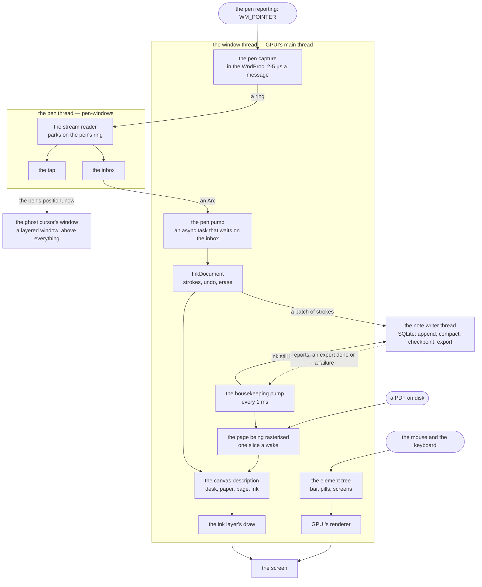
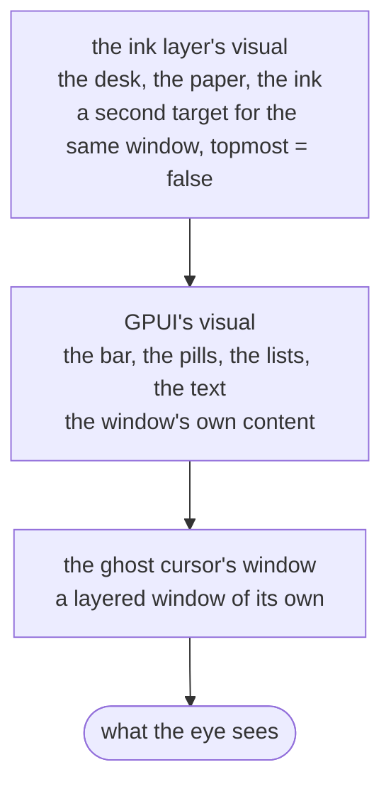
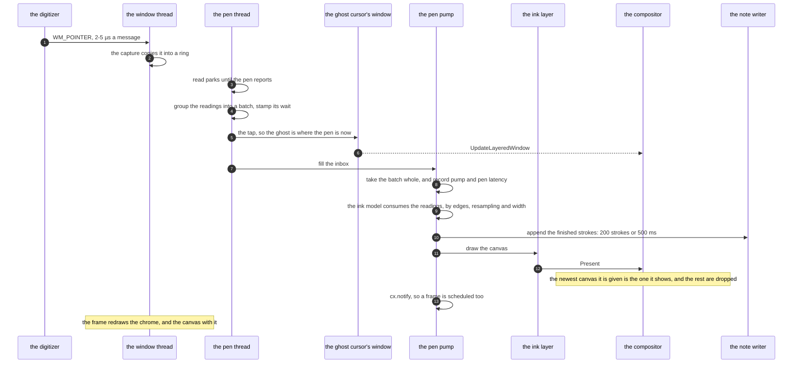
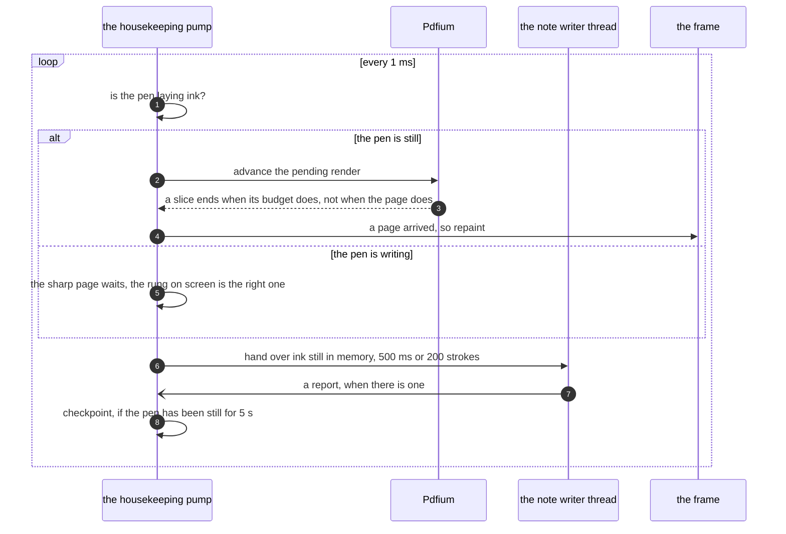
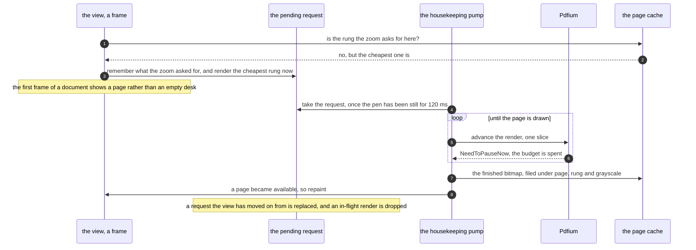
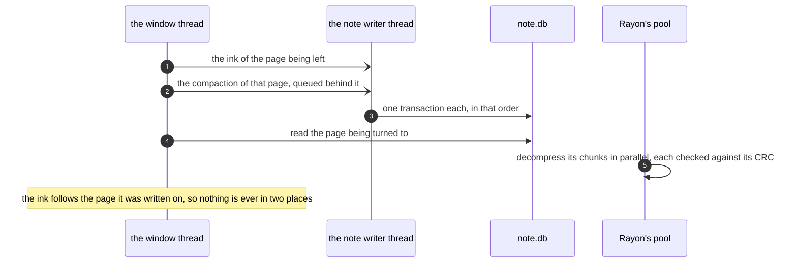
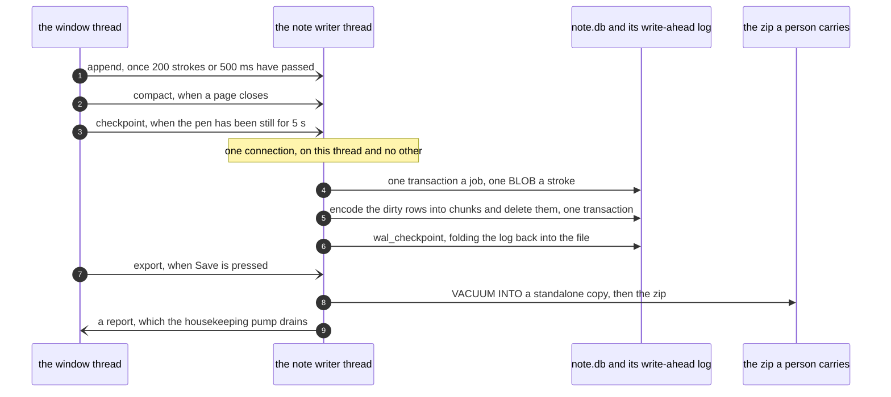

# How cheap-note is put together

This document is the *shape* of the program: what runs where, which thread owns what, what crosses a
thread boundary, and where each kind of work is allowed to happen. It is written to be read before
changing something structural — the reasoning behind the view is in [VIEW.md](VIEW.md), and one
stroke's journey to the disk and back is in [STORE.md](STORE.md). The diagrams are Mermaid, so they
render where the file is read on GitHub.

If you read only one paragraph, read this one:

> **One window, three renderers, and nothing waiting on a clock.** GPUI draws the interface; a Direct2D
> layer of the app's own draws the desk, the paper and the ink *behind* it; the pen's ghost cursor is a
> layered window *above* everything, fed straight from the pen thread. Each is woken by what actually
> changed — a pen reading, a key, a page arriving — rather than by a display, and every path that could
> block is on a thread of its own: the pen has one, and the note's SQLite file has one.

## 1. The shape, in one picture



Four things run the whole app:

| Thread | Owns | What it must never do |
|---|---|---|
| **The window thread** (GPUI's main thread) | the window procedure — including the pen capture — every element tree, the ink model, the canvas description, the ink layer's draw and present, PDF slices, the note's in-memory state | touch the disk; wait for a display; wait for a frame |
| **The pen thread** (`pen-windows`) | the pen stream: parks on it, groups readings into batches, hands each batch to whoever taps, fills the inbox | draw anything but the ghost cursor |
| **The note writer thread** (`note::NoteWriter`) | the note's SQLite connection: batch writes, compaction, checkpoints, exports | touch anything the window thread owns |
| **Rayon's pool** | decompressing a page's chunks on the read path | anything else |

What crosses between them is deliberately dull, because every crossing is a place a frame could wait:

| Crossing | What is handed over | How |
|---|---|---|
| pen thread → window thread | one batch of readings and how long its newest waited | an `Arc` inbox and an async `wait()`, never a poll |
| pen thread → the ghost cursor | the same batch, before the inbox | one `Arc` tap, called from the pen thread |
| window thread → note writer | an append, a compaction, a checkpoint, an export | a queue of jobs; the caller never waits |
| note writer → window thread | what the writer has to say — an export finished, a write that failed | drained by the housekeeping pump, shown in the status line |
| window thread → GPU | the canvas: rectangles, colours, and the strokes | an `Arc` of finished strokes, plus one description per draw |

## 2. One window, three renderers

The window is a single GPUI window, and it is asked for with a **transparent** background
(`main.rs`). That is not decoration: the canvas is not painted by GPUI at all, so the pixels GPUI
leaves alone have to be see-through for the layer behind them to show.

GPUI draws its window into a swap chain of its own and hands it to DirectComposition as the
**topmost** visual of a target made for the window handle. The window carries
`WS_EX_NOREDIRECTIONBITMAP`, so that visual is the whole of the window's content. The canvas layer
makes a *second* target for the same handle, with `topmost = false`, and its visual lands **behind**
GPUI's. That one assumption — a `topmost = false` target renders behind a window whose content is a
topmost one — is what the whole canvas rests on (see `src/ink_layer/device.rs`).



Painted back to front, in that order:

| What | Drawn by | Where it is | Why there |
|---|---|---|---|
| the bar, the pills, the lists, the dialogs, the text | GPUI (lyon, every frame) | the window's own content | an interface is a handful of rectangles and a line of text; a frame is the right unit for it |
| the desk, the page's shadow, the sheet, the ruling, the page's bitmap, the ink | the app's own Direct2D layer | composed *behind* GPUI's content | the ink is not re-submitted per frame: a stroke is built once when it closes and baked once into a geometry realization |
| the pen's ghost cursor | `UpdateLayeredWindow`, over a 32-bit DIB | a layered window of its own, above the app window | a cursor is a position, and a frame is one frame too late for one |

Three renderers rather than one, because their costs are not comparable — and both departures were
measured before they were made:

* **The canvas left.** With the ink painted as GPUI elements, a page of 370 strokes held ~33 fps with
  `paint` at 9.3 ms where an empty page held 143 fps at 0.0 ms; a cached scene moved `paint` to `0.00`
  and left the frame rate where it was, because the engine still replays and re-uploads whatever the
  cache hands it. The cost was in the engine's per-frame work, not in this app's paint callback — so
  the fix was to stop asking it to paint the ink at all.
* **The cursor left.** A pointer that follows the pen is the one thing on screen whose whole meaning is
  *now*; inside the frame it moved at the frame rate, behind the pen's own reporting rate.

What the arrangement costs is stated plainly in `main.rs`: a window whose background it does not own
cannot have subpixel text rendering, so the interface is drawn in grayscale antialiasing.

### The canvas layer's own pieces

| File | Job |
|---|---|
| `src/ink_layer/device.rs` | the Direct3D 11 device, the composition swap chain, the visual behind GPUI's, and the resize |
| `src/ink_layer/render.rs` | Direct2D: the geometry each stroke is baked into, the ruling, the page's bitmap, and the present |
| `src/ink_layer/canvas.rs` | what the app hands over: rectangles, colours, and the ink — all in *logical* window pixels, with the scale travelling alongside |
| `src/ink_layer/mod.rs` | the layer as the app sees it: install it, describe a canvas to it, and draw |

A GPU is **required**: there is no software renderer here and no WARP device to make. A machine that
cannot give Direct3D 11 a hardware device cannot run this app at all — which is already true of the
window itself, since GPUI asks for the same device and has no software path either. What
`InkLayer::install` reports in that case is why, once, at startup.

## 3. A reading, from the digitizer to the screen



Four things about that path are deliberate, and each one is a number:

* **The pump waits on the inbox, not on a timer.** A batch is acted on the instant it lands, so the
  app is woken by the pen and by nothing else — 133 Hz, 240 Hz, whatever the digitizer sends. `pump`
  in the status line is the gap between two wakes, and it is the honest measure of the ink's rate.
  Measured while writing: `pump 11.73 ms (85/s)` against a digitizer reporting ~500 readings a
  second, which is what a pump sharing a thread with the interface's own redrawing looks like.
* **The pump draws the canvas itself.** The ink is the one part of a canvas that changes between
  readings, and a frame on this stack is redrawn on every vblank *and* carries the whole interface
  with it: measured at 0.89 ms of this app's own work inside a 9.6 ms interval, the rest of the
  interval being the window's own drawing. A present of the canvas alone is about a millisecond
  (`canvas 0.77 ms` while writing), and `present` — the gap between two presents — is the rate the
  ink actually reaches the screen at.
* **The ink is handed over as soon as it is drawn, never after waiting for the compositor.** A
  waitable frame-latency object was tried and made the ink *worse*: it made every present wait for the
  compositor to take the last one, which measured `present 21.16 ms (47/s)` where the frames it
  replaced had reached the screen a hundred times a second on a 165 Hz panel. The compositor shows the
  newest canvas it is given and drops the rest, and a dropped frame costs its own draw — 0.3–1 ms —
  which is far cheaper than a wait on every present.
* **Nothing in that path touches the disk.** The strokes go to the writer's queue; a commit is
  invisible from here (see [STORE.md](STORE.md)).

### What the *frame* is still for

The canvas layer draws the ink, but a frame is not redundant: it is what redraws everything the layer
does not own — the bar, the pills, the lists — and it is what re-describes the *sheet*, because the
sheet's geometry (zoom, pan, page, paper) is decided while an element tree is being built. So a frame
draws the canvas too, with the same description the pump would have built, and the two calls are the
same function (`NoteApp::draw_canvas`).

What a frame is *not* for is the ghost cursor, and it never has been since the overlay moved out: a
reading that lays no ink — a pen in range, a hover, a resample that dropped everything — changes
nothing on screen, and no frame is drawn for it. That is what stopped the top of the window flickering
while writing.

## 4. The rest of the time: the housekeeping pump

The second async task wakes every `HOUSEKEEPING_INTERVAL` (`src/app.rs`) — one millisecond — and
does everything that is not the ink. None of it is on the display's clock, and the point of it being
here is that **a rasterisation can never delay a stroke**:



| On every wake | Rule |
|---|---|
| pay for the page the view is waiting for, in slices | a slice is bounded by `pdf::SLICE_BUDGET` (~4 ms); a whole page is 13.4 ms at 2880 px wide, so a synchronous render would be a frame that never arrives |
| skip that page render while the pen is laying ink | the ink pump shares the thread; a page render is paid for out of `PDF_QUIET_INTERVAL` (120 ms) of stillness |
| hand over ink still in memory | `BATCH_INTERVAL` 500 ms / `BATCH_STROKES` 200, whichever comes first |
| drain what the writer has to say | an export that finished, or a write that failed — a writer that failed silently would be ink that is not being saved and an app that looks like it is |
| fold the WAL back into the note file | only when the pen has been still for `CHECKPOINT_QUIET_INTERVAL` (5 s) and at most every `CHECKPOINT_INTERVAL` (5 min) |
| repaint, if any of that changed what is on screen | a page arriving does; the counters do not — the status line is rebuilt by the change that makes it stale, never by a clock |

## 5. The document path

A PDF is opened once per note and its pages are rasterised on demand, on the window thread, in slices.
Four decisions keep that from being the thing that makes writing stutter:

* **The width is quantised onto a ladder** (`PDF_PIXEL_WIDTHS`: 1024, 1536, 2304, 3456 px), because a
  pinch asks for a new width on every event and a rasterisation costs 1.0 ms at 720 px, 3.4 at 1440,
  13.4 at 2880 and 54.5 at 5760. Four rungs cover 5% to 1600% of zoom in a handful of rasterisations
  per gesture, and a page rendered a rung off is simply a little softer — GPUI scales the bitmap to
  the bounds it is painted into.
* **A render is sliced, not synchronous.** Pdfium's progressive render (`IFSDK_PAUSE`, reached through
  this app's own declarations in `src/pdfium.rs`) stops between the pieces of a page, so a slice ends
  when its budget does rather than when the page does. Cancellation needs no flag: a view that moved
  on simply stops advancing the job, and dropping it is what releases the page and the unfinished
  bitmap.
* **The cache key is what the bitmap depends on**: page, rung, whether it is grayscale, and which way
  the reader has turned the page. The grayscale toggle therefore invalidates nothing by hand — the
  bitmaps it changed are simply not the bitmaps the cache holds — and a page turned after it was read
  is a second bitmap beside the first rather than a replacement of it, so turning it back costs nothing.
  The rotation in the key is the *drawn* one (the page's own `/Rotate` and the reader's turn, added),
  while what Pdfium is handed to render is the reader's turn alone: Pdfium applies a page's `/Rotate`
  itself, to the size it reports for the page and to the pixels it produces.
* **A page render waits for the pen to stop** (120 ms of stillness), because the pump is on this
  thread and a stroke must not queue behind a rasterisation.



## 6. The note's pages

Three things can disagree about what "page 4" means — a document's own pages, a note written on blank
sheets, and a page inserted or deleted — so `src/pages.rs` owns one list: one entry per page, in
reading order, saying what it shows. Ink is keyed by the *position in that list*, which is what makes
an insert two small renames rather than a rewrite: **an insert renames the pages after it, and the ink
goes with the sheet it was written on** (in memory and on disk, in one transaction — see `store.rs`).

Two consequences worth knowing before touching the page commands:

* Deleting a page removes it from the **note**, never from the document: the PDF inside a saved note is
  the file that was opened, byte for byte, and this app has no PDF writer. Reopening the original file
  shows every page it always had; the note's list is what says which of them the note is about.
* A PDF's own outline points at *document* pages, so every row of the contents screen carries both the
  document's page (what the contents says) and the note's page (where the row goes). An entry whose
  document page the note does not show is listed, and cannot be opened.



## 7. Where the ink is stored

The store is its own document — [STORE.md](STORE.md) walks one stroke all the way to the disk and back
— and from the architecture's side there is only one thing to know: **the write is on another thread
and nothing waits for it.**

`note::NoteWriter` owns its own SQLite connection in a thread of its own. The window thread only ever
*sends* a job — an append of finished strokes, a compaction of a closed page, a checkpoint, an export
— and the writer's answers come back through `NoteWriter::drain`, which the housekeeping pump empties.
WAL is what keeps the two from meeting: a write never blocks the read that is loading the page about
to be shown.

The other half of that is the shape of a note on disk: a note is a **folder** with `note.db` in it,
`source.pdf` beside it and an `attachments` folder, and `Save` writes the one zip a person carries to
another machine. A note is never opened where the user's files are, because an open SQLite file in a
synchronising folder gets copied and corrupted by the synchroniser (see [STORE.md](STORE.md) §1 for
the whole argument).



## 8. The bar, the screens, and the ghost cursor

There is one rule that decides what a piece of interface is allowed to be, and the pen is why:

> **The pen obeys a line or a state — never a rectangle.** `pen-windows` delivers a raw `WM_POINTER`
> stream, and nothing in the drawing layer can stand between it and the page, so the app refuses the
> pen itself.

* Above `bar_edge()` the reading is a press on a control, below it is ink. The edge is the bar's *real*
  bottom edge, observed from the frame, because only the toolkit knows how the bar wrapped. No ink
  point is ever offset by the bar existing — that is the whole point of the bar floating over the
  canvas rather than taking part in the layout.
* Everything that is a *list* is a **screen** rather than a panel floating on the sheet: the home list,
  the note's marked pages, the document's contents. While one is in front, the app is in a state, and
  the pen lays no ink at all. Two of these screens are deliberate twins — same list, same keys, same
  right-click menu — because a person who has used one has used both.
* The **ghost cursor** is neither: it is a layered window of its own, drawn from the pen thread the
  instant a reading lands, and the system pointer is hidden exactly while it is on screen. The two
  states are driven from the same answer (`follow_pen_with_pointer` / `publish_screen`) so that a
  window with neither cannot happen — a hidden pointer with nothing drawn in its place is a window with
  no cursor at all.

The keyboard follows the same idea: the app has no focusable canvas and no text field, so the chords
that are the *app's* (undo, redo, `Ctrl+N`, `Ctrl+O`, `Ctrl+S`, `Ctrl+B`, `Ctrl+M`) are registered as
actions and global handlers, while the keys a *list* needs (arrows, Enter, Escape, typing into its
search box) belong to the list that has the focus. One rule hands the focus over —
`claim_sheet_keyboard`, which runs on the single frame that a screen changed — because the alternative
was every transition having to remember it, and a window whose focus is left on a node that went away
swallows the note's keys entirely (it did, from opening a note until a rename).

## 9. The modules, by job

| Module | Job |
|---|---|
| **The hand** | |
| `pen` | the capture, its worker thread, the batch tap, and the hand-off inbox |
| `ink` | readings in, strokes out: edges, pointer identity, resampling, width, undo history |
| `cursor` | the ghost's shape: where the pen is, and how it leans |
| `cursor_overlay` | the ghost's own window, drawn from the pen thread |
| `system_cursor` | hiding the system pointer while the ghost replaces it |
| **What is written on** | |
| `canvas` | the sheet: its size (physical), its colour, its ruling |
| `view` | zoom, the two fits, and where the sheet sits in the window |
| `pages` | what a note's pages are, and what each one shows |
| **The drawing** | |
| `ink_layer` | the canvas's own renderer: the device, the visual behind GPUI's, Direct2D, and the description it is handed |
| `app` | every screen, the two pumps, and the canvas description — see [VIEW.md](VIEW.md) |
| **The document** | |
| `pdf` | the Pdfium document, page rendering, and the page cache |
| `pdfium` | Pdfium's own C API, including the sliced render the wrapper does not expose |
| `outline` | the document's own table of contents, and the screen that lists it |
| `bookmarks` | the pages the note has marked, and the screen that lists them |
| **The note, on disk** | |
| `note` | a note as a folder, the writer thread, and the zip it is carried in |
| `store` | the note's SQLite file: schema, batch write, read path |
| `chunk` | a page of ink as one blob: SoA, varints, zstd, CRC32 |
| `recent` | what has been opened, and the index of it the app keeps |
| `settings` | every choice a person can make, one `meta` row each — and all of them belong to a note |
| **The screens** | |
| `home` | the screen the app opens on: the notes that were opened, and what a row can do |
| **Cross-cutting** | |
| `timing` | what every hot path costs, measured rather than guessed |
| `theme` | the palette, the bundled font, and the icons' asset source |
| `error` | the error type every fallible boundary returns |
| `main` | the window, the theme, the key bindings, and the command line |

## 10. What is measured

Every hot path records its own duration into a `Meter` (`src/timing.rs`), and the status line prints
one line built from all of them, so "the writing feels laggy" is answered with a number rather than an
opinion:

| Meter | What it answers |
|---|---|
| `pen→app` | how responsive this is: the wait between the digitizer producing a reading and this process acting on it, including the system's own delay |
| `ink` | the whole of `InkDocument::consume` — readings in, ink out |
| `render` | building a frame's geometry and element tree |
| `canvas` | describing a frame's canvas *and* the layer drawing it — the number that grows with the ink on the page |
| `present` | the gap between two presents: the rate the ink reaches the screen at, whichever wake drew it |
| `pump` | the gap between two wakes of the pen pump: how often the pen handed the app a batch |
| `pdf` / `pdf_slice` | a page rasterised, and one slice of it — two meters because one is paid on a wake of its own and the other is paid *between* frames |
| `ruling` | building the ruling for a sheet that changed |
| `session` | the stretch of time a person chose to measure: fastest, slowest and mean waits, live |

Two rules about the line, both learned the hard way: **it is rebuilt by the change that makes it
stale, never by a clock** (a line that moves on its own is a line nobody can read, and rebuilding it
every frame is what made the top of the window flicker while writing), and **what needs a clock to be
readable is a session a person starts and stops** (`Ctrl+M`), which reports the stretch they chose.

## 11. Invariants worth knowing before touching anything

1. **Nothing waits for a display.** No pacing, no vblank synchronisation, no waiting for a frame to be
   drawn: work is done when the thing it belongs to changes, and a present is handed over immediately.
2. **Nothing waits for a disk.** The note has a thread of its own, and the window thread only ever
   queues work for it.
3. **Nothing lets a rasterisation delay a stroke.** PDF work is sliced, bounded, and skipped while the
   pen is moving.
4. **The app describes, the layer draws.** Rectangles, colours and strokes cross that boundary, and both
   renderers — the layer, and a frame's own painting when there is no layer — are handed the same
   description, so they cannot drift.
5. **One implementation per command.** A bar button and a keystroke end in the same method; the command
   is never implemented twice.
6. **Every setting belongs to a note.** There is no global state at all: `recent.json` is a cache of the
   notes folder, not a setting, and a choice made on a blank sheet is lost with it (the alternative is
   handing one note's paper to another).
7. **A note is a folder, and `Save` exports.** Nothing is *saved* by `Save`: the ink is already in the
   note, and what the button writes is the single file a person carries.
8. **Ink is written as it is laid.** Nothing is ever held only in memory, so there is no unsaved state
   to lose and no command that can lose it.
9. **The pen obeys a line or a state, never a rectangle** (§8), and the same is true of the menu that
   decides whether the ghost cursor is drawn.
10. **A screen is a place, not a question.** There is one window and no modal: a list is somewhere to
    be, and Escape is always the way back from it.
11. **Anything that cannot attach is not an error.** No tablet, no ghost overlay, an old Windows: each
    leaves a working app that says so in its status line.
12. **A setting is added with four small edits and no migration** (`settings.rs`), and a fact a note
    carries that this build does not know is left in the file untouched.
13. **A page's rotation belongs to the page.** It is a field of the note's own page list, not a transform
    of the window, and the ink written on a turned page is stored in the page's own coordinates — so the
    pen's mapping (`ink::paper_of_drawn`) and the layer's matrix (`ink_layer::render::ink_matrix`) are the
    same mapping, and a test compares them. A page's own `/Rotate` is *Pdfium's*: it is in the size Pdfium
    reports for the page and in the pixels it draws, so the app hands Pdfium the reader's turn alone
    (`the_rotation_handed_to_pdfium_is_the_readers_turn` pins that down).

## 12. Requirements, building, running

* **Windows**, x64, and **a GPU with Direct3D 11** — see the end of §2; there is no software path.
* **Rust 1.90+** (see `Cargo.toml`), and the pinned dependency versions in it.
* **Pdfium is not in the repository.** It is downloaded into `vendor/` (`vendor/README.md`), and a build
  copies `vendor/lib/*.dll` next to the executable it produces, so a release build is a *pair* of files
  that work from anywhere. A fresh clone starts, draws and writes ink without it; only opening a PDF
  needs it, and the status line says so when it is missing.

```text
cargo run --release        # the app: it opens on the home list, and Escape returns to it
cargo test                 # 231 tests, including ones that install a real canvas on a window
```

`cargo run` with a path argument opens that file's note and skips the list — which is what a file
association, a shortcut, or a drag onto the executable becomes.

The documents are meant to be read together:

| Document | Answers |
|---|---|
| [ARCHITECTURE.md](ARCHITECTURE.md) | this one: what runs where, and what may wait for what |
| [VIEW.md](VIEW.md) | why the view is the way it is: the frame loop, the bar, the sheet, the gestures, the pen's rules |
| [STORE.md](STORE.md) | one stroke's journey to the disk and back |


